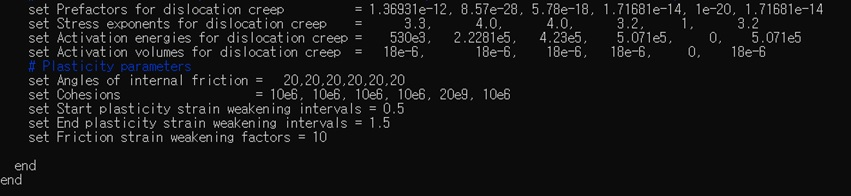
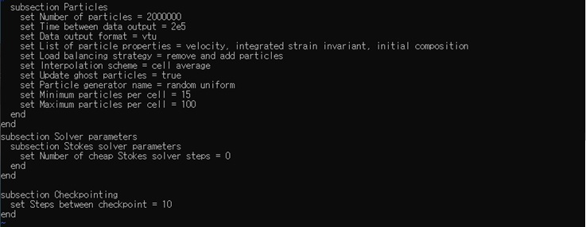

 

# 동해 형성에 대한 유한 요소 수치 모형 제작과 형성 가설의 입증

> 강원대학교 지구물리학과 판구조 · 지구동역학 연구실
>
> *Advisor* 지도교수 소병달
>
> *teammate* 장민석 문병전 홍윤서

### ASPECT

> Download Link : [ASPECT](https://geodynamics.org/cig/software/aspect/)

* 2D 및 3D 모델에서 열 대류 문제를 수치 모사하기 위한 유한 요소 병렬 코드
* 코드의 주 목적은 지구 맨틀의 수치 모사에 있지만 다양한 모형에도 적용 가능
* 복잡한 문제를 해결하기 위한 코드 확장성이 특징으로 동해의 열개 현상과 같은 지구동역학적 모형 제작에 용이함

### Docker

* Particle tracing 기법 사용 시 많은 Particle을 설정하기에  적은 횟수의 연산으로도 큰 용량을 차지하여 하드디스크 용량이 부족해질 수 있음
* 이때 docker를 이용해 독립적인 컨테이너를 생성하여 내부에서 ASPECT를 동작시킴으로 문제를 해결

> docker 내부에서의 ASPECT 설치 및 실행 방법은 [여기](http://www.math.clemson.edu/~heister/manual.pdf)를 참조 
>
> ASEPCT 사용법은 [여기](https://github.com/moonbaaang/FiniteElementMethod/blob/main/ASPECT.pptx)를 참조 

 

## 연구 목표

* 열개 현상은 인장력에 의한 암석권의 확장, 정단층의 발달 및 지각이 얇아지는 현상으로 지구 내부 물질 순환에 있어 중요한 현상

* 이를 지구 동역학 수치 해석 프로그램인 ASPECT를 이용하여 2D 및 3D 열개현상수치 모형을 제작하고 그 진화 과정을 재현

* 제작된 수치 모형을 실제 열개 지역인 동해의 실측 자료(지열류량, 표면고도) 등과 비교, 분석함으로써 적용 가능성을 논의
* 동해 열개의 여러 시나리오를 실험하며 형성 기작 및 발생 과정에 대한 이해를 증진

 

## 연구방법

#### 지배방정식

1. 연속방정식(Continuity equation)

2. 운동량 보존 법칙(Momentum conservation equation)

3. 에너지 보존 법칙(Conservation of energy)

#### 유동학 성질

(1) Mohr-Coulmb Failure

(2) Dislocation creep

(3) Effective viscosity

#### 수치 모형 설정

(1) 2차원 모형 경계조건과 초기조건

* 최상부를 Sticky air로 설정, 3층 구조로 이루어진 암석권 모델을 좌우로 등속인장시킴
* 질량보존법칙을 만족시키기 위해 암석권에서 유출되는 질량만큼 동일한 질량을 하부에서 유입

### Setup

* Set Dimension, Start/End time, solver, CFL, and Pressure

* Set model size, Mesh refinement

* Set Boundary velocity
  * 양방향의 등속인장을 시킴
  * 유체의 비압축성과 질량보존을 위해 빠져나간 질량만큼 상하부에서 물질을 유입시킴

* Set Compositional fields
  * Free surface가 아닌 Free slip을 이용하였기에 최상부에 Sticky Air 추가

* Set Boundary / Initial composition
  * weak zone은 10km X 10km로 줌

* Set Boundary Temperature
  * 모델에 적용시킬 Geothermal gradient에 따라 상하부 경계의 온도를 설정

* Set Initial Temperature
  * Composition field의 순서에 따라 지온 구배를 설정
  * Weak zone을 만들기 위해 지온 구배에 비해 고온을 지니도록 동일한 위치에 설정

* Set Heating model

* Set Material model
  * Visco Plastic으로 설정

* Set gravity model

* Set Particle
  * mesh수에 따라 적절하게 지정
  * Particle의 행동 양상 및 생성 방법도 선택이 가능(메뉴얼 참조)
  * check point 기능을 통해 중간에 연산을 멈추더라도 마지막 point에서 재연산이 가능

* 연산 시작
  * DOF(degrees of freedom)가 높을수록 연산 시간이 길어짐
  * mpirun -np N (N은 cpu수)명령어를 이용하여 다중 코어를 사용
  * 이때 연산속도는 **N에 비례하여 선형으로 증가하는 경향**이 있으나 **일정 cpu개수 이상으로는 연산속도가 일정**해지는 모습을 보임

 

(2) 3차원 모형 경계조건과 초기조건

* 최상부는 자유표면(Free surface)으로 설정
* Pull-apart 모델의 경우 Perturbation을 2개로 나누어 x축으로 80km, y축으로 50km 이격하여 위치시킴

* Two stage 모델은 11 Ma ~ 3 Ma 까지 수평열개, 3 Ma ~ 0 Ma 까지는 부채꼴 확장을 적용

 

(3) 온도 경계조건과 초기조건

* 중심부를 기준으로 열개를 발생시키기 위해 강도가 가장 강한 깊이에서 20 km (Z-Axis) x 20 km (X-Axis) 크기의 온도 Anomaly(평균 187 K)를 주어 주변부에 비해 비교적 강도를 낮춘 Perturbation을 갖게 함

## 연구 결과

#### (1) 2차원 수치 모형

* 실험 결과, 열개 과정에서 변화 양상이 두드러지게 나타나며 전단대가 관찰
* 전단대가 성장함에 따라 상하부 지각에 변형을 가하며 지각 전체가 얇아짐
* 지각이 얇아지며 중심부의 하부 물질이 대류 및 상승, 이들이 전달하는 열은 대륙지각의 변형과 열개 작용을 가속
* 열개가 진행함에 따라 정단층과 지구대의 대칭구조가 확인됨

* Particle 결과만 확인할 뿐 아니라 temperature, Strain-rate, Viscosity 관점에서도 다음과 같이 확인 가능

#### (2) 3차원 수치 모형 - Pull-apart 모델

|                             3Ma                              |                     5Ma                     |                             8Ma                              |
| :----------------------------------------------------------: | :-----------------------------------------: | :----------------------------------------------------------: |
| Anomaly 중심으로 양측면 열개 현상이 발생 열개 사이에 분지 생성 시작 | 열개가 진화함에 따라 분지가 침강하고 넓어짐 | 분지가 최대로 넓어지며 100km X 100km 규모의 사다리꼴 형태를 보임 |

 

#### (3) 3차원 수치 모형 - Two-Stage rifting 모델

* 수평열개 기간 후 부채꼴 모양으로 벌어지는 것을 실제로 관찰 가능

## 결론

* 지구 동역학 수치 해석 프로그램인 ASPECT를 이용하여 2D 및 3D 열개 현상 수치 모형을 제작하고 그 진화 과정을 재현

* 모형 내에서 정단층의 형성과 대륙 지각이 끊어지는 모습이 뚜렷하게 나타나며 수치 모형이 열개 현상에 적용 가능함을 확인

* 울릉분지에서 탐사한 지열류량 자료를 열개 정지 후 압축시킨 모형과 대조하여 비교적 일치하는 결과를 얻음으로써 적용한 지온 구배의 타당성을 획득
* Pull-apart 모델의 경우 형성되는 분지의 크기가 동해에 비해 매우 작고 동해는 전단대 사이 간 거리가 멀어 분지를 형성할 만큼의 응력 전달이 힘들며 여러 단점이 존재함
  * 동해 형성 가설에는 부적합
* Two stage rifting 모델의 경우 대규모 분지 형성이 가능하고 실제 지형과 일치하는 회전 양상이 관찰되며 기존 가설의 단점들이 보완됨
  * 동해 형성 가설에 적합

## 향후 과제

* 추후 연구에서는 동해에 작용하고 있는 다양한 응력을 적용, 여러 조건을 실험하여 형성 기작에 대한 이해를 증진시키고 발전된 모델을 통해 동해 진화에 대한 지구 동역학적 재현을 추구
